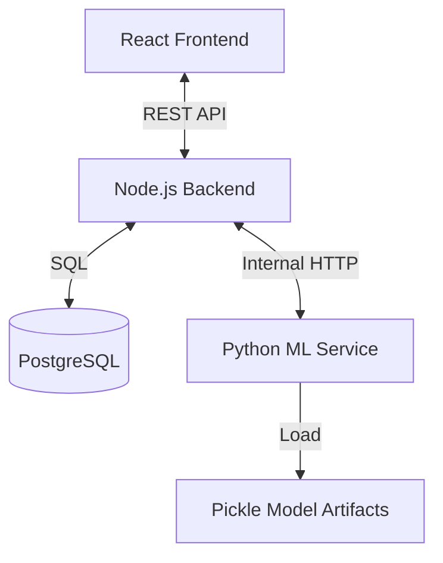

# Predictive Lead Scoring Portal


> **Revolutionizing Sales with Explainable AI.**
> A championship-grade CRM that not only tracks leads but **predicts** their likelihood to convert using advanced Machine Learning.


---

## 📖 Table of Contents

- [Background](#-background)
- [Key Features](#-key-features)
- [Tech Stack](#-tech-stack)
- [System Architecture](#-system-architecture)
- [Getting Started](#-getting-started)
- [Screenshots](#-screenshots)

---

## 🎯 Background

Our team is developing a Predictive Lead Scoring system for banking sales, a machine learning–based solution designed to help marketing and sales teams identify, categorize, and prioritize potential customers with the highest likelihood of conversion. In traditional outbound campaigns such as term-deposit promotions, target selection is often random or based only on simple demographic segmentation, resulting in wasted time and inefficient follow-ups. This project aims to accurately predict conversion probability using historical interaction data, behavioral patterns, and customer demographics, enabling banks to optimize their outreach strategies. By leveraging AI-driven insights, the system enhances sales effectiveness, improves conversion rates, reduces operational costs, and strengthens customer relationships through more targeted, data-driven engagement.

---

## ✨ Key Features & Workflow Capabilities

This solution is designed around two core personas—**Admin** and **Sales**—managing the complete Lead Lifecycle from acquisition to conversion.

### 🛡️ Admin Module: Data & Strategy Control

_Strategic control center for managing data pipeline and sales operations._

- **Lead Acquisition Pipeline**:

  - **Bulk Import**: Upload CSV datasets (large scale) with automatic validation.

  - **Manual Entry**: Single lead creation for walk-in or referral cases.

  - **Auto-Prediction**: The integrated Machine Learning engine **automatically predicts conversion probability** the moment leads are uploaded or created.

- **Operational Management (CRUD)**:

  - Full control to **Create, Read, Update, and Delete**: Leads, Sales Agents, and Campaigns.

  - **History Management**: Audit and manage activity logs and interaction outcomes.

- **Campaign Orchestration**:

  - Create targeted campaigns (e.g., "Q1 Term Deposit Promo").

  - Assign specific agents to campaigns.

  - Monitor campaign health and agent performance.

### 💼 Sales Module: Execution & Intelligence

_Empowering agents with AI-driven insights to close deals faster._

- **Intelligent Lead Management**:

  - **Prioritized Lists**: View leads sorted by **ML Score** (Prediction Probability).

  - **Leads Tracking**: Track and assign leads to any campaign and change their status from Available to Tracked.

  - **Kanban Workflow**: Drag-and-drop leads across pipeline stages (e.g., _Uncontacted_ $\rightarrow$ _Contacted_).

- **Outbound Execution**:

  - **Activity Logging**: Log calls, emails, and meetings with details (Duration, Contact Method, Status).

  - **Real-time History**: All logs are instantly saved to the Lead's Activity History.

- **Deal Finalization & Re-Scoring**:

  - **Outcome Tracking**: Mark leads as **Deal** or **Reject**.

  - **Dynamic Re-scoring**: When activities are logged, the ML engine **re-calculates the score** based on new interaction data (e.g., a "Long Duration" call increases score), keeping the pipeline fresh.

  - **Recycling**: Leas marked as 'Reject' or 'Deal' can be re-entered into new campaigns if needed.

- **Sales Support Tools**:

  - **Integrated Calendar**: A dedicated tool to help sales agents manage their schedule, appointments, and follow-ups outside the main pipeline flow.

- **Advanced Analytics**:

  - **Team Dashboard**: Track Teams performance and conversion rates.

  - **Segment Analysis**: Deep dive into performance per institution or customer segment.

### 🧠 AI Intelligence Suite (The "Brain")

- **Explainable AI (XAI) with SHAP**:

  - _Why this score?_ Sales agents can see exactly which factors contributed to a lead's score (e.g., "High Balance and Explained it why").

  - Builds trust in AI predictions by providing transparency.

- **Context-Aware AI Assistant (Groq)**:

  - An embedded Chat Assistant that "sees" the page context.

  - Sales agents can ask: _"How should I approach this client based on their history?"_ or _"Summarize this lead's activity."_

### ⚙️ General & Platform

- **Adaptive UI**: Light/Dark Mode support for comfortable all-day usage.

- **Profile Management**: Secure user profile handling and session management.

## 🛠 Tech Stack

| Component     | Technology            | Description                                             |
| ------------- | --------------------- | ------------------------------------------------------- |
| **Frontend**  | React 19 + Vite       | Ultra-fast UI with modern React hooks.                  |
| **Styling**   | Tailwind CSS          | Sleek, responsive, and maintainable design system.      |
| **Backend**   | Node.js + Express     | Robust REST API handling business logic.                |
| **Database**  | PostgreSQL            | Relational data integrity for critical sales info.      |
| **ML Engine** | Python + Flask        | Dedicated microservice for Random Forest models & SHAP. |
| **AI Data**   | Scikit-learn + Pandas | Data processing and model inference pipelines.          |
| **DevOps**    | Docker                | Containerized environment for easy deployment.          |

---

## 🏗 System Architecture

The project follows a **Microservice-lite** architecture:



1.  **Frontend** serves the UI and communicates only with the Node.js Backend.
2.  **Node.js Backend** handles auth, CRUD, and business logic.
3.  **Python ML Service** is isolated; it receives lead data from Node.js, computes scores, and returns predictions.

---

## 🚀 Getting Started

### Prerequisites

- Node.js (v18+)
- Python (3.9+)
- PostgreSQL

- PostgreSQL

### ⚙️ Configuration (First Step)

Before running the app, you must configure the environment variables. The project uses a **Root .env** for Docker/Orchestration and specific **Service .env** files for individual components.

1.  **Root (Docker)**: Copy `.env.example` to `.env` in the root folder.
    *   *Required for Docker Compose to set Postgres credentials and ports.*
2.  **Backend**: Copy `.env.example` to `.env` in the `backend/` folder.
3.  **Frontend**: Copy `.env.example` to `.env` in the `frontend/` folder.

| Variable | Service | Description |
| :--- | :--- | :--- |
| `PGUSER` / `PGPASSWORD` | **Root** | Database credentials passed to Docker containers. |
| `JWT_SECRET` | Backend | **CRITICAL**: Use a unique, strong random string. |
| `DATABASE_URL` | Backend | Connection string (ensure it matches Docker credentials). |
| `GROQ_API_KEY` | Backend | API Key for AI chat features. |
| `VITE_API_BASE_URL` | Frontend | URL of backend API. |

### 🐳 Running with Docker (Recommended)

1.  **Clone the Repository**
    ```bash
    git clone https://github.com/yourusername/plscore-project.git
    cd plscore-project
    ```

2.  **Setup Environment**
    Ensure you have created the **Root .env** file.

3.  **Start Services**
    ```bash
    # Development Mode
    docker-compose up --build
    ```
    *This will automatically start Backend (5000), Frontend (5173), ML API (5001), and PostgreSQL.*

### Installation (Manual Manual)

1.  **Clone the Repository**

    ```bash
    git clone https://github.com/yourusername/plscore-project.git
    cd plscore-project
    ```

2.  **Setup Backend**

    ```bash
    cd backend
    npm install
    cp .env.example .env # Configure your DB credentials
    npm run migrate      # Run database migrations
    npm run dev
    ```

3.  **Setup Frontend**
    ```bash
    cd ../frontend
    npm install
    cp .env.example .env # Important: Usage of VITE_API_BASE_URL
    npm run dev
    ```

4.  **Setup Machine Learning Service**
    ```bash
    cd ../machine-learning
    pip install -r requirements.txt
    python ml_api.py
    ```

Visit `http://localhost:5173` to view the app!

---

## 📸 Screenshots

|                            Dashboard View                             |                     Lead Detail (AI Explanation)                     |
| :-------------------------------------------------------------------: | :------------------------------------------------------------------: |
|  |  |

---

Made with ❤️ by [Your Name/Team]
