# LeadGo - Predictive Lead Scoring Portal


---

## 📖 Table of Contents

- [Background](#-background)
- [Key Features](#-key-features)
- [Tech Stack](#-tech-stack)
- [System Architecture](#-system-architecture)
- [Getting Started](#-getting-started)
- [Project Documentation](#-project-documentation)
- [Screenshots](#-screenshots)

---

## 🎯 Background

Our team is developing a Predictive Lead Scoring system for banking sales, a machine learning–based solution designed to help marketing and sales teams identify, categorize, and prioritize potential customers with the highest likelihood of conversion. In traditional outbound campaigns such as term-deposit promotions, target selection is often random or based only on simple demographic segmentation, resulting in wasted time and inefficient follow-ups. This project aims to accurately predict conversion probability using historical interaction data, behavioral patterns, and customer demographics, enabling banks to optimize their outreach strategies. By leveraging AI-driven insights, the system enhances sales effectiveness, improves conversion rates, reduces operational costs, and strengthens customer relationships through more targeted, data-driven engagement.

---

## ✨ Key Features & Workflow Capabilities

This solution is designed around two core personas—**Admin** and **Sales**—managing the complete Lead Lifecycle from acquisition to conversion.

### 🛡️ Admin Module: Data & Strategy Control

_Strategic control center for managing data pipeline and sales operations._

- **Lead Acquisition Pipeline**:

  - **Bulk Import**: Upload CSV datasets (large scale) with automatic validation.

  - **Manual Entry**: Single lead creation for walk-in or referral cases.

  - **Auto-Prediction**: The integrated Machine Learning engine **automatically predicts conversion probability** the moment leads are uploaded or created.

- **Operational Management (CRUD)**:

  - Full control to **Create, Read, Update, and Delete**: Leads, Sales Agents, and Campaigns.

  - **History Management**: Audit and manage activity logs and interaction outcomes.

- **Campaign Orchestration**:

  - Create targeted campaigns (e.g., "Q1 Term Deposit Promo").

  - Assign specific agents to campaigns.

  - Monitor campaign health and agent performance.

### 💼 Sales Module: Execution & Intelligence

_Empowering agents with AI-driven insights to close deals faster._

- **Intelligent Lead Management**:

  - **Prioritized Lists**: View leads sorted by **ML Score** (Prediction Probability).

  - **Leads Tracking**: Track and assign leads to any campaign and change their status from Available to Tracked.

  - **Kanban Workflow**: Drag-and-drop leads across pipeline stages (e.g., _Uncontacted_ $\rightarrow$ _Contacted_).

- **Outbound Execution**:

  - **Activity Logging**: Log calls, emails, and meetings with details (Duration, Contact Method, Status).

  - **Real-time History**: All logs are instantly saved to the Lead's Activity History.

- **Deal Finalization & Re-Scoring**:

  - **Outcome Tracking**: Mark leads as **Deal** or **Reject**.

  - **Dynamic Re-scoring**: When activities are logged, the ML engine **re-calculates the score** based on new interaction data (e.g., a "Long Duration" call increases score), keeping the pipeline fresh.

  - **Recycling**: Leas marked as 'Reject' or 'Deal' can be re-entered into new campaigns if needed.

- **Sales Support Tools**:

  - **Integrated Calendar**: A dedicated tool to help sales agents manage their schedule, appointments, and follow-ups outside the main pipeline flow.

- **Advanced Analytics**:

  - **Team Dashboard**: Track Teams performance and conversion rates.

  - **Segment Analysis**: Deep dive into performance per institution or customer segment.

### 🧠 AI Intelligence Suite (The "Brain")

- **Explainable AI (XAI) with SHAP**:

  - _Why this score?_ Sales agents can see exactly which factors contributed to a lead's score (e.g., "High Balance and Explained it why").

  - Builds trust in AI predictions by providing transparency.

- **Context-Aware AI Assistant (Meta LLaMA)**:

  - An embedded Chat Assistant that "sees" the page context.

  - Sales agents can ask: _"How should I approach this client based on their history?"_ or _"Summarize this lead's activity."_

### ⚙️ General & Platform

- **Adaptive UI**: Light/Dark Mode support for comfortable all-day usage.

- **Profile Management**: Secure user profile handling and session management.

## 🛠 Tech Stack & Libraries

### Core Technologies
| Component     | Technology            | Description                                             |
| ------------- | --------------------- | ------------------------------------------------------- |
| **Frontend**  | React 19 + Vite       | Ultra-fast UI with modern React hooks.                  |
| **Styling**   | Tailwind CSS          | Sleek, responsive, and maintainable design system.      |
| **Backend**   | Node.js + Express     | Robust REST API handling business logic.                |
| **Database**  | PostgreSQL            | Relational data integrity for critical sales info.      |
| **ML Engine** | Python + Flask        | Dedicated microservice for Random Forest models & SHAP. |
| **AI Chat**   | Groq + Meta LLaMA     | Context-aware AI assistant for sales insights.          |
| **DevOps**    | Docker                | Containerized environment for easy deployment.          |

### Frontend Libraries
| Library | Purpose |
|---------|--------|
| `react` v19 | Core UI framework |
| `react-router-dom` v7 | Client-side routing |
| `axios` | HTTP client for API calls |
| `recharts` | Data visualization charts |
| `react-big-calendar` | Calendar component |
| `react-datepicker` | Date picker inputs |
| `react-hot-toast` | Toast notifications |
| `react-icons` | Icon library |
| `lottie-react` | Animation library |
| `date-fns` | Date manipulation |
| `tailwindcss` | Utility-first CSS framework |

### Backend Libraries
| Library | Purpose |
|---------|--------|
| `express` v4 | Web framework |
| `jsonwebtoken` | JWT authentication |
| `bcrypt` / `bcryptjs` | Password hashing |
| `pg` | PostgreSQL client |
| `node-pg-migrate` | Database migrations |
| `multer` | File upload handling |
| `csv-parser` / `fast-csv` | CSV file processing |
| `express-validator` | Input validation |
| `helmet` | Security headers |
| `cors` | Cross-origin resource sharing |
| `express-rate-limit` | API rate limiting |
| `axios` | HTTP client for ML API calls |

### Machine Learning Libraries
| Library | Purpose |
|---------|--------|
| `flask` + `flask-cors` | ML API server |
| `scikit-learn` | Random Forest model |
| `pandas` + `numpy` | Data processing |
| `matplotlib` + `seaborn` | Visualization |
| `tensorflow` | Deep learning (MLP model) |
| `joblib` | Saving/loading ML models |
| `scipy.stats` | RandomizedSearchCV parameter distributions |
| `faker` | Generate dummy dataset |
| `shap` | Explainable AI (feature contributions) |
| `huggingface_hub` | Model hosting & download |
| `gunicorn` | Production WSGI server |

### Hosting & Deployment
| Service | Component | URL |
|---------|-----------|-----|
| **Vercel** | Frontend | Free tier hosting |
| **Railway** | Backend API | Container hosting |
| **Railway** | ML Service | Container hosting |
| **Supabase** | PostgreSQL Database | Managed PostgreSQL |
| **Hugging Face** | ML Model Storage | Model artifacts hosting |

---

## 🏗 System Architecture

The project follows a **Microservice-lite** architecture:

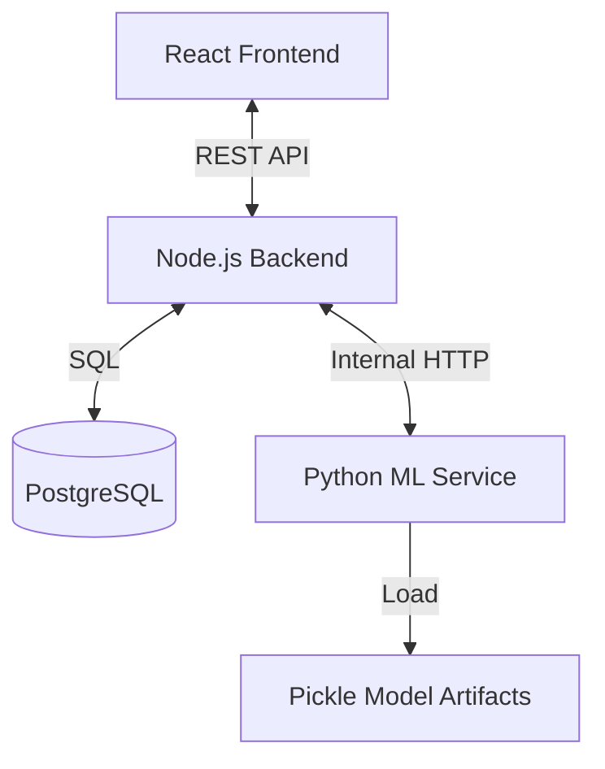

1.  **Frontend** serves the UI and communicates only with the Node.js Backend.
2.  **Node.js Backend** handles auth, CRUD, and business logic.
3.  **Python ML Service** is isolated; it receives lead data from Node.js, computes scores, and returns predictions.

---

## 🚀 Getting Started

### Prerequisites

- Docker & Docker Compose (recommended)
- Node.js (v18+) - for manual setup
- Python (3.9+) - for manual setup
- PostgreSQL/Supabase account - for database

### ⚙️ Configuration (First Step)

Before running the app, you must configure the environment variables. The project uses a **Root .env** for Docker/Orchestration and specific **Service .env** files for individual components.

1.  **Root (Docker)**: Copy `.env.example` to `.env` in the root folder.
    *   *Required for Docker Compose to set Postgres credentials and ports.*
2.  **Backend**: Copy `.env.example` to `.env` in the `backend/` folder.
3.  **Frontend**: Copy `.env.example` to `.env` in the `frontend/` folder.
4.  **ML Service**: Copy `.env.example` to `.env` in the `machine-learning/` folder.

| Variable | Service | Description |
| :--- | :--- | :--- |
| `PGUSER` / `PGPASSWORD` | **Root** | Database credentials passed to Docker containers. |
| `JWT_SECRET` | Backend | **CRITICAL**: Use a unique, strong random string. |
| `DATABASE_URL` | Backend | Connection string (ensure it matches Docker credentials). |
| `GROQ_API_KEY` | Backend | API Key for AI chat features. |
| `VITE_API_BASE_URL` | Frontend | URL of backend API. |
| `HF_REPO_ID` | ML Service | Hugging Face Repo ID to download models (e.g., `user/repo`). |

### 🐳 Running with Docker (Recommended)

1.  **Clone the Repository**
    ```bash
    git clone https://github.com/A25-CS073/predictive-lead-scoring-portal.git
    cd predictive-lead-scoring-portal
    ```

2.  **Setup Environment Files**
    ```bash
    cp backend/.env.example backend/.env
    cp machine-learning/.env.example machine-learning/.env
    cp frontend/.env.example frontend/.env
    ```
    Edit `backend/.env` with your Supabase/PostgreSQL credentials.

3.  **Start All Services**
    ```bash
    docker-compose up --build
    ```

4.  **Access the Application**
    - Frontend: http://localhost:5173
    - Backend API: http://localhost:5000
    - ML API: http://localhost:5001

5.  **Production Mode**
    ```bash
    docker-compose -f docker-compose.yml -f docker-compose.prod.yml up --build
    ```

### Installation (Manual)

1.  **Clone the Repository**

    ```bash
    git clone https://github.com/A25-CS073/predictive-lead-scoring-portal.git
    cd predictive-lead-scoring-portal
    ```

2.  **Setup Backend**

    ```bash
    cd backend
    npm install
    cp .env.example .env # Configure your DB credentials
    npm run migrate      # Run database migrations
    npm run dev
    ```

3.  **Setup Frontend**
    ```bash
    cd ../frontend
    npm install
    cp .env.example .env # Important: Usage of VITE_API_BASE_URL
    npm run dev
    ```

4.  **Setup Machine Learning Service**
    ```bash
    cd ../machine-learning
    pip install -r requirements.txt
    python ml_api.py
    ```

Visit `http://localhost:5173` to view the app!

### 🔑 Default Accounts

Use these credentials to log in (populated by database seeds):

| Role | Email | Password | Access |
| :--- | :--- | :--- | :--- |
| **Admin** | `admin@accenture.com` | `password123` | Full strategic access (Pipeline, Users, Campaigns). |
| **Sales** | `sales1@accenture.com` | `password123` | Sales execution access (Leads, Outbound, Analytics). |

---

## 📚 Project Documentation

### 🔄 Application Workflow

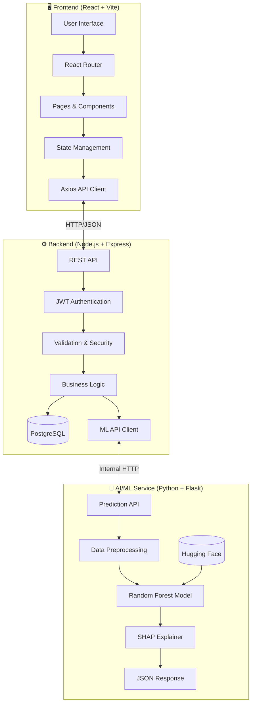

**Workflow Details:**

1. **Frontend Flow:**
   - User interacts with React UI → React Router handles navigation
   - Components fetch/update data via Axios → Backend REST API
   - State managed locally with React hooks

2. **Backend Flow:**
   - Express receives requests → JWT middleware validates token
   - express-validator checks input → Controllers execute logic
   - PostgreSQL stores/retrieves data → Response sent to Frontend

3. **AI/ML Flow:**
   - Backend sends lead data to ML Service
   - Flask API preprocesses data 
   - Random Forest model predicts conversion probability
   - SHAP generates feature explanations
   - Results returned to Backend → stored in DB → sent to Frontend

### 🏗️ System Architecture Details

LeadGo uses a **Microservice-lite** architecture with three main services:

| Service | Technology | Port | Responsibility |
|---------|------------|------|----------------|
| **Frontend** | React 19 + Vite | 5173 | User interface, state management, API calls |
| **Backend** | Node.js + Express | 5000 | Authentication (JWT), business logic, CRUD operations, database access |
| **ML Service** | Python + Flask | 5001 | Model inference, SHAP explanations, prediction API |

### 🤖 Machine Learning Model Explanation

**Model Type:** Random Forest Classifier with SMOTE (Synthetic Minority Oversampling)

**Purpose:** Predict the probability of a lead converting to a successful deal (term deposit subscription).

**Key Features Used (16 total):**
| Feature | Type | Description |
| :--- | :--- | :--- |
| **age** | Integer | Age of the client. |
| **job** | Categorical | Type of job of the client (e.g., 'admin.', 'blue-collar', 'management'). |
| **marital** | Categorical | Marital status of the client ('divorced', 'married', 'single'). |
| **education** | Categorical | Highest education level attained (e.g., 'high.school', 'university.degree'). |
| **default** | Binary | Indicates whether the client has credit in default (**'yes'**/**'no'**). |
| **balance** | Integer | Average yearly balance of the client (in Euros). |
| **housing** | Binary | Indicates whether the client has a housing loan (**'yes'**/**'no'**). |
| **loan** | Binary | Indicates whether the client has a personal loan (**'yes'**/**'no'**). |
| **contact** | Categorical | Type of communication used in the last contact ('cellular', 'telephone'). |
| **day_of_week** | Date | Day of the week when the last contact was made. |
| **month** | Date | Month when the last contact was made (e.g., 'mar', 'oct', 'dec'). |
| **duration** | Integer | Duration of the last call (in seconds). **Note:** This feature has a strong influence on the target but should **not be used** for realistic predictive modeling as it is only known after the call is completed. |
| **campaign** | Integer | Total number of contacts performed during this campaign with the client (includes the last contact). |
| **pdays** | Integer | Number of days since the client was last contacted in a previous campaign. **Value -1** means the client was not previously contacted. |
| **previous** | Integer | Total number of contacts prior to the current campaign. |
| **poutcome** | Categorical | Outcome of the previous marketing campaign ('failure', 'nonexistent', 'success'). |
| **y** | Binary | **Target Variable:** Indicates whether the client subscribed to a term deposit (**'yes'**/**'no'**). |

**How Scoring Works:**
1. Lead data is preprocessed (encoding, normalization, IQR outlier handling)
2. Random Forest model outputs probability (0-100%)
3. SHAP (SHapley Additive exPlanations) identifies feature contributions
4. Results displayed with explanations like: *"High balance increases conversion likelihood"*

### 📊 Model Validation

**Dataset:** Bank Marketing Dataset (~41,000 records)

**Validation Methodology:**
- Train/Test Split: 80/20
- Cross-Validation: 5-Fold
- Class Imbalance Handling: SMOTE (Synthetic Minority Oversampling)

**Performance Metrics:**
| Metric | Score |
| :--- | :--- |
| **Test Accuracy** | **0.8934** (~89%) |

| Kelas | Precision | Recall | F1-Score | Support |
| :--- | :--- | :--- | :--- | :--- |
| **0 (No Subscription)** | 0.96 | 0.92 | 0.94 | 7985 |
| **1 (Subscription)** | **0.53** | **0.68** | **0.60** | 1058 |
| Macro Average | 0.75 | 0.80 | 0.77 | 9043 |
| Weighted Average | 0.91 | 0.89 | 0.90 | 9043 |

### 📖 Quick Portal Usage Guide

#### For Admin:
| Task | Steps |
|------|-------|
| **Add Leads (CSV)** | Leads Management → Upload CSV → Set sample limit (optional) → Submit |
| **Add Leads (Manual)** | Leads Management → Manual Entry → Fill form → Submit |
| **Create Campaign** | Campaigns → Add New → Enter details → Assign agents |
| **Manage Sales Agents** | Sales Management → Add/Edit/Delete agents |

#### For Sales:
| Task | Steps |
|------|-------|
| **View Dashboard** | Login → Dashboard shows KPIs, trends, segment analysis |
| **Track Leads** | All Leads → Select lead → Click "Track" → Assign to campaign |
| **Contact Lead** | Leads Tracker → Click lead → Log activity (call/email) |
| **Finalize Deal** | Outbound Modal → Log final outcome → Click "Deal" or "Reject" |
| **Use AI Assistant** | Click chat icon → Ask questions about current page data |
| **View AI Explanation** | Lead Detail → See SHAP explanation for score factors |

#### UI Features:
- **Light/Dark Mode:** Settings → Toggle theme
- **Calendar:** Dashboard → View/manage appointments
- **Filters:** All Leads → Filter by status, score, campaign

---

## 📸 Screenshots

### Authentication & Navigation
| Login Page |
| :---: |
| 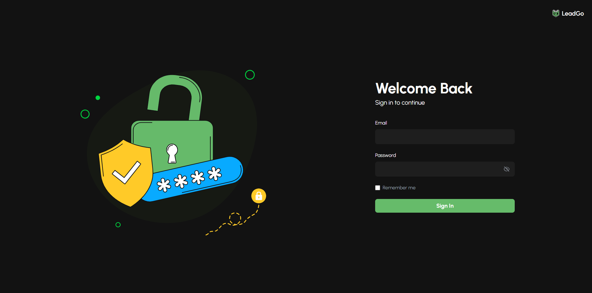 |

### Dashboard & Analytics
| Main Dashboard | Segment Analysis |
| :---: | :---: |
| 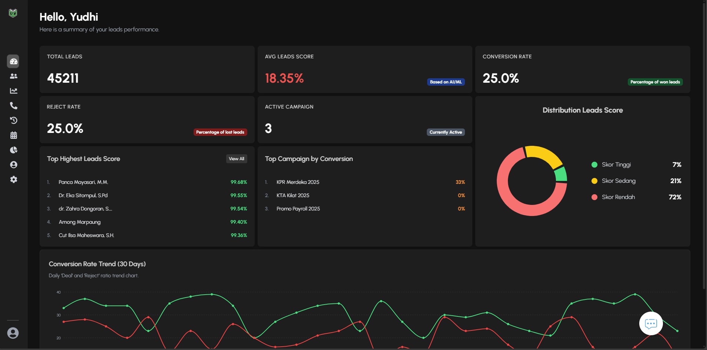 | 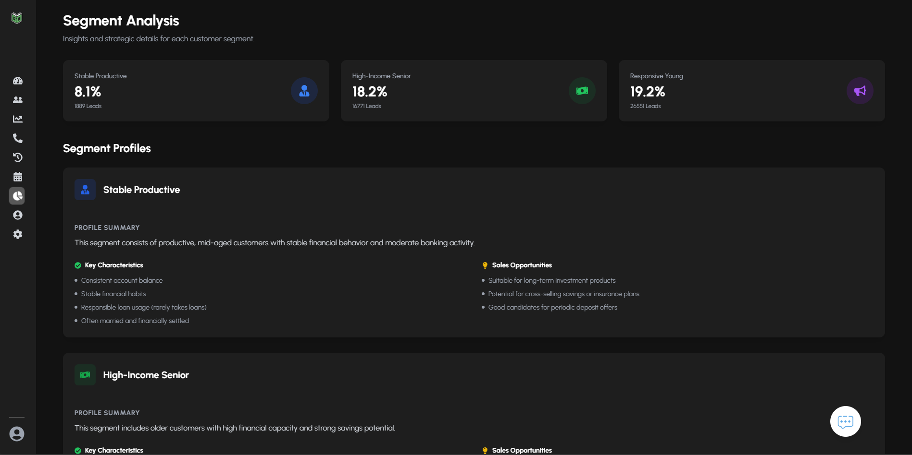 |

### Lead Management
| All Leads | Lead Tracking |
| :---: | :---: |
| 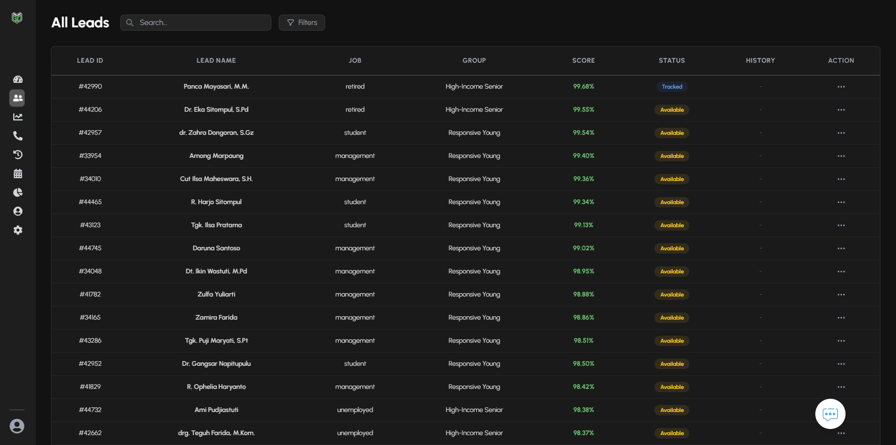 | 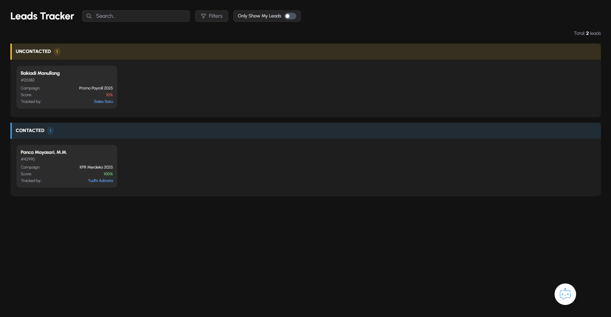 |

### Outbound & Activity
| Outbound Detail | Activity History |
| :---: | :---: |
| 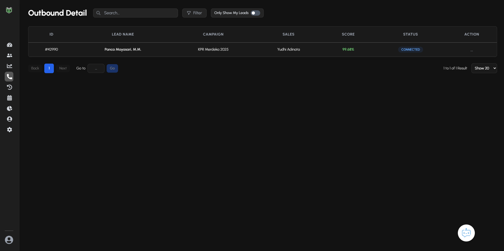 | 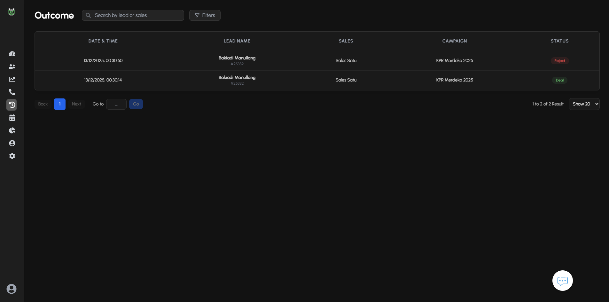 |

### AI Intelligence
| SHAP Explanation | AI Chatbot |
| :---: | :---: |
| 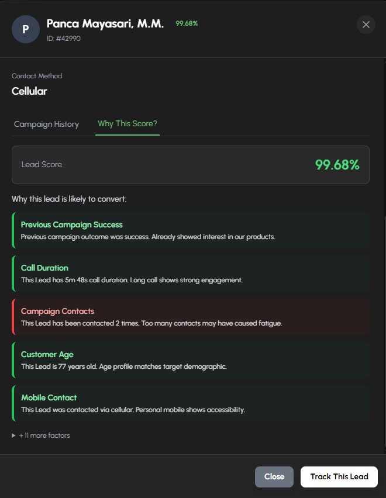 | 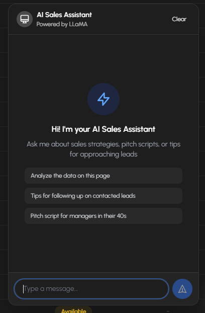 |

### Deal Finalization & Outcome
| Finalize Lead |
| :---: |
| 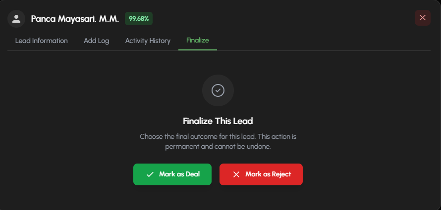|

### Admin Features
| Lead Upload (CSV) | Campaign Management |
| :---: | :---: |
| 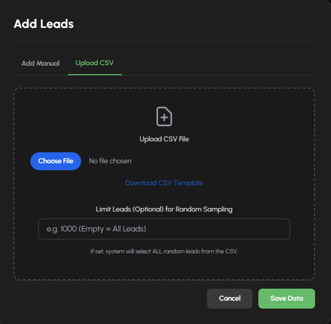 | 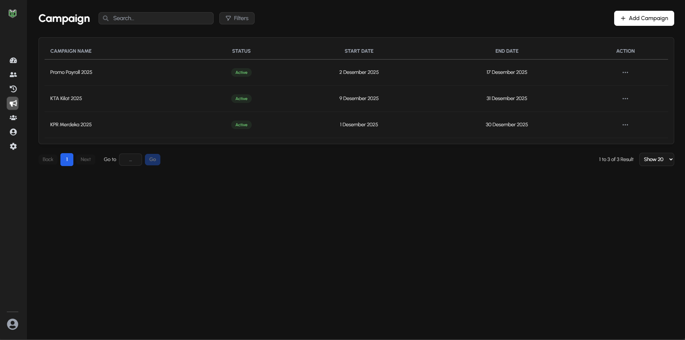 |

---

Made with ❤️ by LeadGo Team
